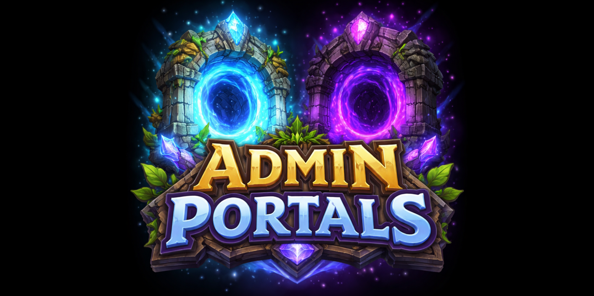
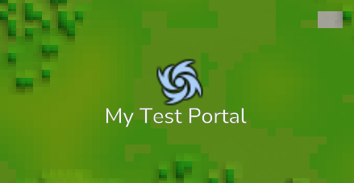
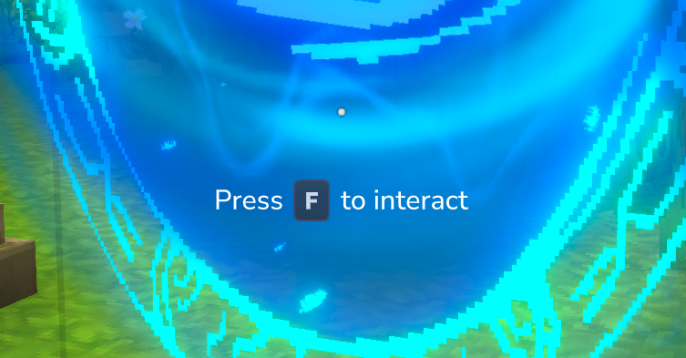

# HiWire - AdminPortals v0.1.0

A custom portal management plugin for Hytale single- and multiplayer by HiWire Studio



## Features

- **Configurable Portals** - Place portal blocks that execute commands when players interact with them
- **Multiple Portal Styles** - Choose between Forgotten Temple (blue) and Void (purple) portal variants
- **Command Execution Modes** - Execute commands as the server or as the interacting player
- **Dynamic Placeholders** - Use placeholders in commands to insert player/location data
- **Map Markers** - Optionally display portals on the world map with custom icons and labels
- **Multilingual** - Supports English (en-US), German (de-DE) and many more (if added)
- **Customizable** - Override translations, UI definitions, and assets

## Requirements

- Hytale or Hytale Server
- Java 25

## Installation

### Using CurseForge App

The easiest way to install mods is via the [CurseForge App](https://www.curseforge.com/download/app), which handles installation and updates automatically.

### Manual Installation

1. Download the mod JAR file
2. Place it in the mods directory:
   - **Windows:** `%appdata%\Hytale\UserData\Mods`
   - **Mac:** `~/Library/Application Support/Hytale/UserData/Mods`
   - **Linux (Flatpak):** `~/.var/app/com.hypixel.HytaleLauncher/data/Hytale/UserData/Mods`
   - **Dedicated Server:** `/mods` folder in your server directory
3. Restart the game or server

Since Hytale uses a server internally for both singleplayer and multiplayer, this plugin works in both modes.

## Commands

| Command                             | Description                            | Executor    | Permission                                                  |
|-------------------------------------|----------------------------------------|-------------|-------------------------------------------------------------|
| `/adminportals`                     | Root command for AdminPortals          | Any         | `hiwire.adminportals.command.adminportals`                  |
| `/adminportals configmode`          | Configuration mode commands            | Any         | `hiwire.adminportals.command.adminportals.configmode`       |
| `/adminportals configmode toggle`   | Toggle configuration mode for yourself | Player only | `hiwire.adminportals.command.adminportals.configmode.toggle`|
| `/adminportals placeholder`         | Placeholder management commands        | Any         | `hiwire.adminportals.command.adminportals.placeholder`      |
| `/adminportals placeholder list`    | List all registered placeholders       | Any         | `hiwire.adminportals.command.adminportals.placeholder.list` |

## Permissions

For command permissions, see the [Commands](#commands) table above.

| Permission                               | Description                              |
|------------------------------------------|------------------------------------------|
| `hiwire.adminportals.portal.config.view` | Open the portal configuration UI         |
| `hiwire.adminportals.portal.config.edit` | Save changes to the portal configuration |

## Configuration

### Entering Configuration Mode

To configure portals, you must first enter configuration mode by running:

```
/adminportals configmode toggle
```

While in configuration mode, interacting with a portal block will open the configuration UI instead of activating the portal. Run the command again to exit configuration mode.

### Configuration UI


The configuration UI allows you to set the following options:

| Option              | Description                                                                                                   |
|---------------------|---------------------------------------------------------------------------------------------------------------|
| **Type**     | The config type. Currently only the "Command" type is supported                                               |
| **Command**         | The command to execute when the player is interacting with or walking through the portal                      |
| **Execution Mode**  | `Server` - runs the command as console / CommandSender; `Player` - runs the command as the interacting player |
| **Map Marker Text** | Optional label displayed on the world map and compass                                                         |
| **Map Marker Icon** | Icon filename from server assets for the map marker (default: `Warp.png`)                                     |

### Map Markers

When you configure a portal with a **Map Marker Text**, the portal will be displayed on the world map and compass, making it easy for players to locate.

**Portal marker on the world map:**



**Portal marker on the compass:**


## Placeholders

Use these placeholders in portal commands. They are replaced with actual values when the portal is activated.

| Placeholder | Description |
|-------------|-------------|
| `{PlayerUsername}` | Username of the player activating the portal |
| `{PlayerUuid}` | UUID of the player activating the portal |
| `{PosX}` | X coordinate of the portal block |
| `{PosY}` | Y coordinate of the portal block |
| `{PosZ}` | Z coordinate of the portal block |
| `{WorldName}` | Name of the world containing the portal |

### Example Commands

Executed as server / command sender:
```
tp {PlayerUsername} 100 64 200
say Player {PlayerUsername} ({PlayerUuid}) has entered a portal at ({PosX}, {PosY}, {PosZ}) in world {WorldName}
```

Executed as player:
```
spawn
```

## Portal Blocks


Portal blocks can be found in the creative inventory under **Blocks > Portals**.

### Using Portals

Players can activate a configured portal in two ways:
- **Walking through** the portals hitbox
- **Interacting** with the portal using the interact key



If a portal has not been configured yet, the player will receive a chat message indicating that the portal is not configured.

### Portal Base (Two-Piece)

A platform with a separate portal effect block on top:

- `HiWire_AdminPortals_PortalBase` - The base platform
- `HiWire_AdminPortals_PortalBase_Portal_ForgottenTemple` - Blue portal effect
- `HiWire_AdminPortals_PortalBase_Portal_Void` - Purple portal effect

### Standalone Portals

Single-block portals:

- `HiWire_AdminPortals_StandalonePortal_ForgottenTemple` - Blue standalone portal
- `HiWire_AdminPortals_StandalonePortal_Void` - Purple standalone portal

## Customization

The plugin supports user overrides for translations, UI definitions, and assets. Place your customizations in the plugin's data folder under `/overrides`.

### Translation Files

The plugin uses translation files located in `/Server/Languages/{language}/HiWire/AdminPortals/`:

- `Items.lang` - Portal item names and descriptions
- `ChatMessages.lang` - Chat notifications and command messages
- `UI.lang` - User interface labels

Translation files with all keys are created and automatically updated at `mods/HiWire_AdminPortals/override/Server/Languages/{language}/HiWire/AdminPortals/`.
Edit these files to customize translations without modifying the original plugin files.

### Custom Placeholders

Plugin developers can register custom placeholders by accessing the `PlaceholderManager`:

```java
final var plugin = PluginManager.get().getPlugin(new PluginIdentifier("HiWire", "AdminPortals"));
if (plugin instanceof AdminPortalsPlugin adminPortalsPlugin) {
    final var placeholderManager = adminPortalsPlugin.getPlaceholderManager();

    // Register a simple placeholder. It can be used with {ServerName}
    placeholderManager.register("ServerName", ctx -> "My Server");

    // Register a placeholder using context data
    placeholderManager.register("PlayerHealth", ctx -> {
        final var playerRef = ctx.playerRef();
        final var health = // Get player health via playerRef
        return String.valueOf(health);
    });
}
```

The `PlaceholderContext` provides access to:
- `playerRef()` - The player activating the portal
- `world()` - The world containing the portal
- `pos()` - The block position (Vector3i)
- `portalConfig()` - The portal's configuration
- `itemStack()` - The item used for interaction (nullable)
- `interactionType()` - The type of interaction
- `interactionContext()` - Additional interaction context

## Building from Source

```bash
./gradlew build
```

The compiled plugin JAR will be in `plugin/build/libs/`.

## License

MIT License

Copyright (c) 2026 HiWire Studio

Permission is hereby granted, free of charge, to any person obtaining a copy
of this software and associated documentation files (the "Software"), to deal
in the Software without restriction, including without limitation the rights
to use, copy, modify, merge, publish, distribute, sublicense, and/or sell
copies of the Software, and to permit persons to whom the Software is
furnished to do so, subject to the following conditions:

The above copyright notice and this permission notice shall be included in all
copies or substantial portions of the Software.

THE SOFTWARE IS PROVIDED "AS IS", WITHOUT WARRANTY OF ANY KIND, EXPRESS OR
IMPLIED, INCLUDING BUT NOT LIMITED TO THE WARRANTIES OF MERCHANTABILITY,
FITNESS FOR A PARTICULAR PURPOSE AND NONINFRINGEMENT. IN NO EVENT SHALL THE
AUTHORS OR COPYRIGHT HOLDERS BE LIABLE FOR ANY CLAIM, DAMAGES OR OTHER
LIABILITY, WHETHER IN AN ACTION OF CONTRACT, TORT OR OTHERWISE, ARISING FROM,
OUT OF OR IN CONNECTION WITH THE SOFTWARE OR THE USE OR OTHER DEALINGS IN THE
SOFTWARE.

## Support

- **Author:** HiWire-Nick
